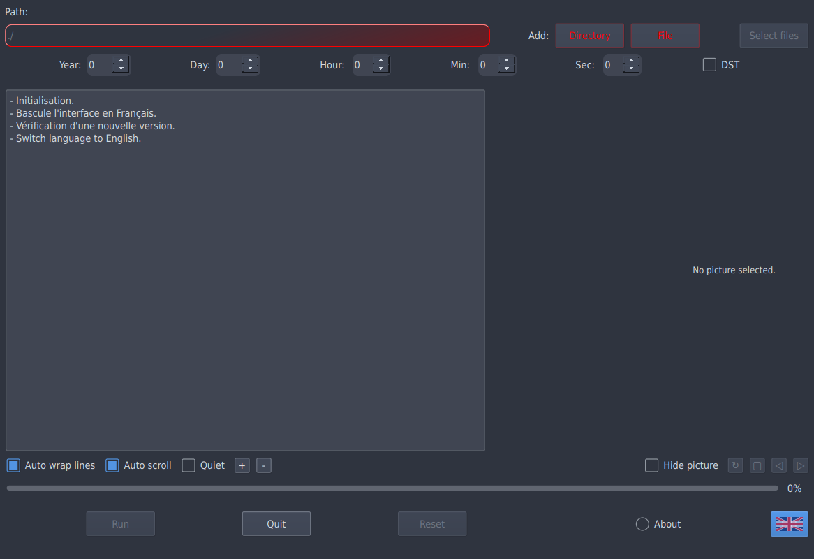
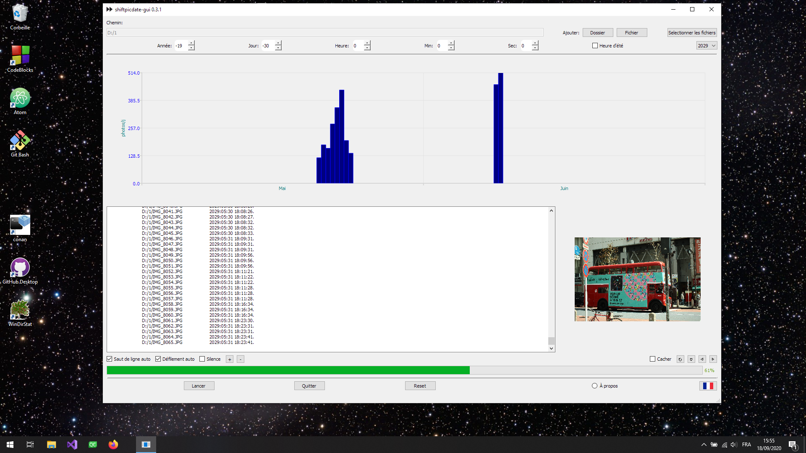

# shiftpicdate-gui [](https://cloud.drone.io/a-lemonnier/shiftpicdate-gui) 

Shift the exif/XMP date using Exiv2 (linux) or WIC (win) C++ libraries.


> Dependencies:
- Qt 5
- Exiv2 (UNIX)
- CMake
- g++ or MSVC++ for C++17

> Lang.:
- English
- French

> TODO:
- "dialog.setOption(QFileDialog::ShowDirsOnly, true)" does not work on Windows, deprecated "QFileDialog::DirectoryOnly" used instead.

> Binaries 

[](https://sourceforge.net/projects/shiftpicdate-gui/files/latest/download)

> Gentoo amd64 EN


> Gentoo amd64 FR


> Windows 10 64 FR



> Build

- gentoo - shiftpicdate-gui % cmake .
```
-- The CXX compiler identification is GNU 10.2.0
-- Detecting CXX compiler ABI info
-- Detecting CXX compiler ABI info - done
-- Check for working CXX compiler: /usr/bin/c++ - skipped
-- Detecting CXX compile features
-- Detecting CXX compile features - done
-- Configuring done
-- Generating done
-- Build files have been written to: /home/gentoo/Prog/cpp//shiftpicdate-gui

```

- gentoo - shiftpicdate-gui % make
```
Scanning dependencies of target shiftpicdate-gui_autogen
[  9%] Automatic MOC and UIC for target shiftpicdate-gui
[  9%] Built target shiftpicdate-gui_autogen
[ 18%] Generating res/ts/french.ts
Scanning directory '/home/gentoo/Prog/cpp//shiftpicdate-gui'...
Updating 'res/ts/french.ts'...
    Found 73 source text(s) (0 new and 73 already existing)
[ 27%] Generating french.qm
Updating '/home/gentoo/Prog/cpp//shiftpicdate-gui/french.qm'...
    Génération de 72 traductions (2 terminées et 70 non terminées)
    1 texte source non traduit a été ignoré
[ 36%] Generating qrc_res.cpp
Scanning dependencies of target shiftpicdate-gui
[ 45%] Building CXX object CMakeFiles/shiftpicdate-gui.dir/shiftpicdate-gui_autogen/mocs_compilation.cpp.o
[ 54%] Building CXX object CMakeFiles/shiftpicdate-gui.dir/main.cpp.o
[ 63%] Building CXX object CMakeFiles/shiftpicdate-gui.dir/mainwindow.cpp.o
/home/gentoo/Prog/cpp//shiftpicdate-gui/mainwindow.cpp: Dans la fonction membre « void MainWIndow::on_bRot_clicked() »:
/home/gentoo/Prog/cpp//shiftpicdate-gui/mainwindow.cpp:218:45: attention: « const QPixmap* QLabel::pixmap() const » est obsolète: Use the other overload which returns QPixmap by-value [-Wdeprecated-declarations]
  218 |         QPixmap cPmap(*ui->picLabel->pixmap());
      |                                             ^
Dans le fichier inclus depuis /usr/include/qt5/QtWidgets/QLabel:1,
                 depuis /home/gentoo/Prog/cpp//shiftpicdate-gui/mainwindow.h:31,
                 depuis /home/gentoo/Prog/cpp//shiftpicdate-gui/mainwindow.cpp:1:
/usr/include/qt5/QtWidgets/qlabel.h:78:20: note: déclaré ici
   78 |     const QPixmap *pixmap() const; // ### Qt 7: Remove function
      |                    ^~~~~~
[ 72%] Building CXX object CMakeFiles/shiftpicdate-gui.dir/fsdialog.cpp.o
[ 81%] Building CXX object CMakeFiles/shiftpicdate-gui.dir/shiftpicdate.cpp.o
[ 81%] Generating res/ts/french.ts
Scanning directory '/home/gentoo/Prog/cpp//shiftpicdate-gui'...
Updating 'res/ts/french.ts'...
    Found 73 source text(s) (0 new and 73 already existing)
[ 81%] Generating qrc_res.cpp
[ 90%] Building CXX object CMakeFiles/shiftpicdate-gui.dir/qrc_res.cpp.o
[100%] Linking CXX executable shiftpicdate-gui
[100%] Built target shiftpicdate-gui
```
