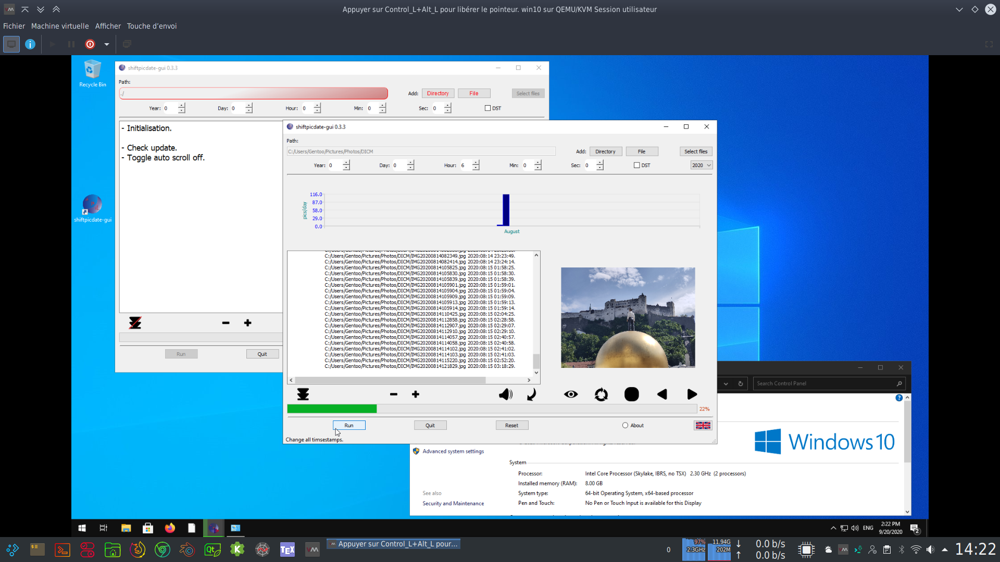

# shiftpicdate-gui
Shift the exif/XMP date using Exiv2 (linux) or WIC (win) C++ libraries.

> Dependencies:
- Qt 5
- Exiv2 (UNIX)
- CMake

> Lang:
- English
- French

> TODO:
- "dialog.setOption(QFileDialog::ShowDirsOnly, true)" does not work on Windows, deprecated "QFileDialog::DirectoryOnly" used instead.
- fix "QPixmap QPixmap::transformed(const QMatrix&, Qt::TransformationMode) const" depreciation.

