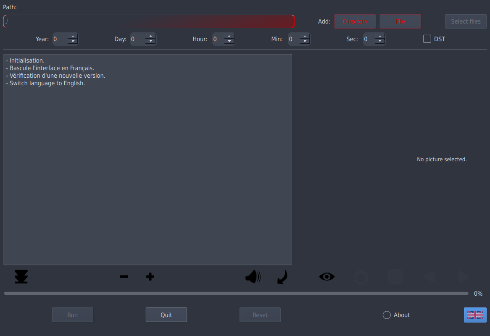
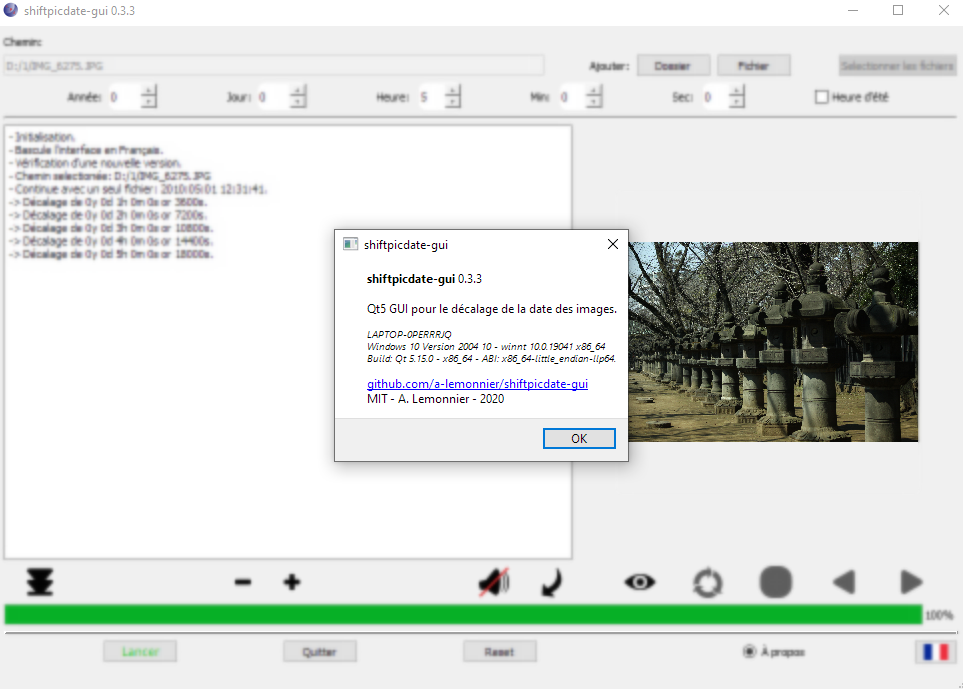

# shiftpicdate-gui [](https://cloud.drone.io/a-lemonnier/shiftpicdate-gui)  [](https://sourceforge.net/projects/shiftpicdate-gui/files/latest/download)

Shift the exif/XMP date using Exiv2 (linux) or WIC (win) C++ libraries.


> Dependencies:
- Qt 5
- Exiv2 (UNIX)
- CMake
- g++ / MSVC++ for C++17

> Debian/Ubuntu packages (assuming same package names):
- sudo apt-get install cmake
- sudo apt-get install qt5-default qtbase5-dev qttools5-dev qtbase5-dev-tools libqt5charts5-dev
- sudo apt-get install exiv2 libexiv2-dev

> Fedora:
- dnf install qt5-*
- dnf install exiv2-*

> Gentoo: 
- emerge -av $(qlist -IC "dev-qt/*")
- USE="png" emerge -av media-gfx/exiv2

> Windows: check the sourceforce page.

> Lang.:
- English
- French

> TODO:
- Optimize IO drive perf... but actually, how to fix this with Exiv2 and WIC ?
- "dialog.setOption(QFileDialog::ShowDirsOnly, true)" does not work on Windows, deprecated "QFileDialog::DirectoryOnly" used instead.


> Gentoo amd64 EN


> Gentoo amd64 FR


> (VM) Windows 10 64 EN


> Windows 10 64 EN


> Build

- gentoo - shiftpicdate-gui/ % cmake .
```
-- The CXX compiler identification is GNU 10.2.0
-- Detecting CXX compiler ABI info
-- Detecting CXX compiler ABI info - done
-- Check for working CXX compiler: /usr/bin/c++ - skipped
-- Detecting CXX compile features
-- Detecting CXX compile features - done
CC: gcc
CXX: g++
-- Found Boost: /usr/include (found suitable version "1.74.0", minimum required is "1.40") found components: filesystem 
-- Configuring done
-- Generating done
-- Build files have been written to: /home/gentoo/src/shiftpicdate-gui-0.3.3-src


```

- gentoo - shiftpicdate-gui/ % make
```
Scanning dependencies of target shiftpicdate-gui_autogen
[  9%] Automatic MOC and UIC for target shiftpicdate-gui
[  9%] Built target shiftpicdate-gui_autogen
[ 18%] Generating res/ts/french.ts
Scanning directory '/home/gentoo/src/shiftpicdate-gui-0.3.3-src'...
Updating 'res/ts/french.ts'...
    Found 100 source text(s) (0 new and 100 already existing)
    Kept 14 obsolete entries
[ 27%] Generating french.qm
Updating '/home/gentoo/src/shiftpicdate-gui-0.3.3-src/french.qm'...
    Génération de 100 traductions (1 terminées et 99 non terminées)
[ 36%] Generating qrc_res.cpp
Scanning dependencies of target shiftpicdate-gui
[ 45%] Building CXX object CMakeFiles/shiftpicdate-gui.dir/shiftpicdate-gui_autogen/mocs_compilation.cpp.o
[ 54%] Building CXX object CMakeFiles/shiftpicdate-gui.dir/main.cpp.o
[ 63%] Building CXX object CMakeFiles/shiftpicdate-gui.dir/mainwindow.cpp.o
[ 72%] Building CXX object CMakeFiles/shiftpicdate-gui.dir/fsdialog.cpp.o
[ 81%] Building CXX object CMakeFiles/shiftpicdate-gui.dir/shiftpicdate.cpp.o
[ 81%] Generating res/ts/french.ts
Scanning directory '/home/gentoo/src/shiftpicdate-gui-0.3.3-src'...
Updating 'res/ts/french.ts'...
    Found 100 source text(s) (0 new and 100 already existing)
[ 81%] Generating qrc_res.cpp
[ 90%] Building CXX object CMakeFiles/shiftpicdate-gui.dir/qrc_res.cpp.o
[100%] Linking CXX executable shiftpicdate-gui
[100%] Built target shiftpicdate-gui

```
